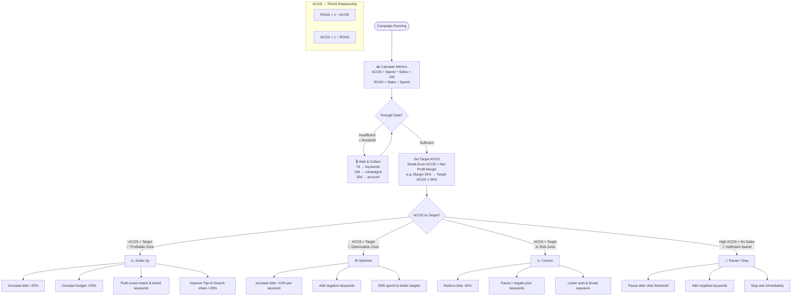

# ACOS & ROAS – Decision Flow Diagram

```mermaid
flowchart TD
    Start([Campaign Running]) --> Calc["📊 Calculate Metrics\nACOS = Spend ÷ Sales × 100\nROAS = Sales ÷ Spend"]
    Calc --> Data{Enough Data?}

    Data -- "Insufficient\n< threshold" --> Wait["⏳ Wait & Collect\n7d → keywords\n14d → campaigns\n30d → account"]
    Wait --> Data

    Data -- "Sufficient" --> Margin["Set Target ACOS\nBreak-Even ACOS = Net Profit Margin\ne.g. Margin 30% → Target ACOS ≤ 30%"]
    Margin --> Zone{ACOS vs Target?}

    Zone -- "ACOS < Target\n✅ Profitable Zone" --> Scale["📈 Scale Up"]
    Zone -- "ACOS ≈ Target\n🔄 Optimization Zone" --> Optimize["⚙️ Optimize"]
    Zone -- "ACOS > Target\n⚠️ Risk Zone" --> Control["📉 Control"]
    Zone -- "High ACOS + No Sales\n🚫 Inefficient Spend" --> Pause["🛑 Pause / Stop"]

    Scale --> S1[Increase bids +25%]
    Scale --> S2[Increase budget +25%]
    Scale --> S3[Push exact-match & brand keywords]
    Scale --> S4[Improve Top-of-Search share +20%]

    Optimize --> O1[Increase bids +10% per keyword]
    Optimize --> O2[Add negative keywords]
    Optimize --> O3[Shift spend to better targets]

    Control --> C1[Reduce bids -50%]
    Control --> C2[Pause / negate poor keywords]
    Control --> C3[Lower auto & broad exposure]

    Pause --> P1[Pause after click threshold]
    Pause --> P2[Add negative keywords]
    Pause --> P3[Stop ads immediately]

    subgraph inv["ACOS ↔ ROAS Relationship"]
        direction LR
        F1["ROAS = 1 ÷ ACOS"]
        F2["ACOS = 1 ÷ ROAS"]
    end
```
