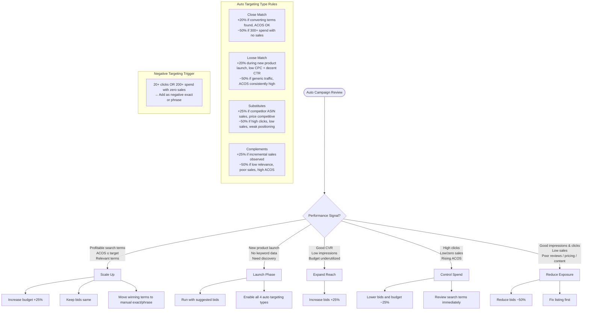

# Auto Campaign Adjustment Rules – Decision Flow

```mermaid
flowchart TD
    Start([Auto Campaign Review]) --> Signal{Performance Signal?}

    Signal -- "Profitable search terms\nACOS ≤ target\nRelevant terms" --> Scale[Scale Up]
    Scale --> S1[Increase budget +25%]
    Scale --> S2[Keep bids same]
    Scale --> S3[Move winning terms to manual exact/phrase]

    Signal -- "New product launch\nNo keyword data\nNeed discovery" --> Launch[Launch Phase]
    Launch --> L1[Run with suggested bids]
    Launch --> L2[Enable all 4 auto targeting types]

    Signal -- "Good CVR\nLow impressions\nBudget underutilized" --> Expand[Expand Reach]
    Expand --> E1[Increase bids +25%]

    Signal -- "High clicks\nLow/zero sales\nRising ACOS" --> Control[Control Spend]
    Control --> C1[Lower bids and budget −25%]
    Control --> C2[Review search terms immediately]

    Signal -- "Good impressions & clicks\nLow sales\nPoor reviews / pricing / content" --> Reduce[Reduce Exposure]
    Reduce --> R1[Reduce bids −50%]
    Reduce --> R2[Fix listing first]

    subgraph AutoTypes["Auto Targeting Type Rules"]
        direction LR
        CM["Close Match\n+20% if converting terms found, ACOS OK\n−50% if 300+ spend with no sales"]
        LM["Loose Match\n+20% during new product launch, low CPC + decent CTR\n−50% if generic traffic, ACOS consistently high"]
        SUB["Substitutes\n+25% if competitor ASIN sales, price competitive\n−50% if high clicks, low sales, weak positioning"]
        COMP["Complements\n+25% if incremental sales observed\n−50% if low relevance, poor sales, high ACOS"]
    end

    subgraph Negatives["Negative Targeting Trigger"]
        N1["20+ clicks OR 200+ spend with zero sales\n→ Add as negative exact or phrase"]
    end
```
