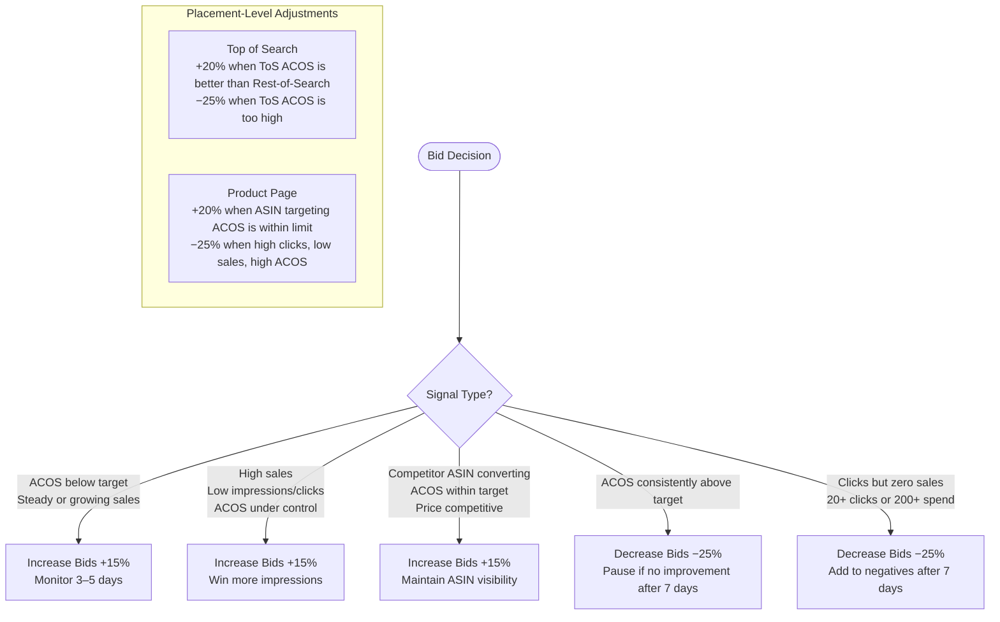

# Bidding Adjustment Rules – Decision Flow

```mermaid
flowchart TD
    Start([Bid Decision]) --> Signal{Signal Type?}

    Signal -- "ACOS below target\nSteady or growing sales" --> I1["Increase Bids +15%\nMonitor 3–5 days"]
    Signal -- "High sales\nLow impressions/clicks\nACOS under control" --> I2["Increase Bids +15%\nWin more impressions"]
    Signal -- "Competitor ASIN converting\nACOS within target\nPrice competitive" --> I3["Increase Bids +15%\nMaintain ASIN visibility"]

    Signal -- "ACOS consistently above target" --> D1["Decrease Bids −25%\nPause if no improvement after 7 days"]
    Signal -- "Clicks but zero sales\n20+ clicks or 200+ spend" --> D2["Decrease Bids −25%\nAdd to negatives after 7 days"]

    subgraph Placements["Placement-Level Adjustments"]
        direction LR
        TS["Top of Search\n+20% when ToS ACOS is better than Rest-of-Search\n−25% when ToS ACOS is too high"]
        PP["Product Page\n+20% when ASIN targeting ACOS is within limit\n−25% when high clicks, low sales, high ACOS"]
    end
```
