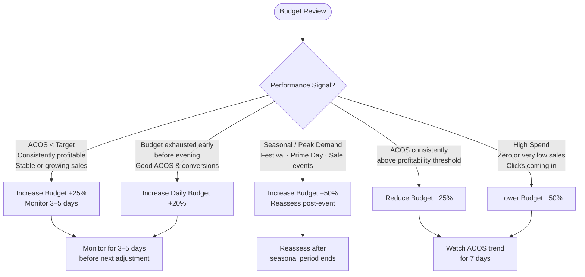

# Ad Budget Rules – Decision Flow

```mermaid
flowchart TD
    Start([Budget Review]) --> Check{Performance Signal?}

    Check -- "ACOS < Target\nConsistently profitable\nStable or growing sales" --> Inc1["Increase Budget +25%\nMonitor 3–5 days"]
    Check -- "Budget exhausted early\nbefore evening\nGood ACOS & conversions" --> Inc2["Increase Daily Budget +20%"]
    Check -- "Seasonal / Peak Demand\nFestival · Prime Day · Sale events" --> Inc3["Increase Budget +50%\nReassess post-event"]

    Check -- "ACOS consistently\nabove profitability threshold" --> Dec1["Reduce Budget −25%"]
    Check -- "High Spend\nZero or very low sales\nClicks coming in" --> Dec2["Lower Budget −50%"]

    Inc1 --> Monitor["Monitor for 3–5 days\nbefore next adjustment"]
    Inc2 --> Monitor
    Inc3 --> PostSeason["Reassess after\nseasonal period ends"]
    Dec1 --> Watch["Watch ACOS trend\nfor 7 days"]
    Dec2 --> Watch
```
