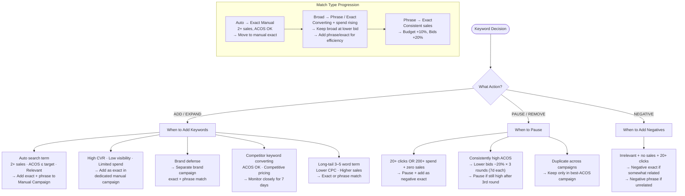

# Keyword Targeting Adjustment Rules – Decision Flow

```mermaid
flowchart TD
    Start([Keyword Decision]) --> Action{What Action?}

    Action -- "ADD / EXPAND" --> Add[When to Add Keywords]
    Add --> A1["Auto search term\n2+ sales · ACOS ≤ target · Relevant\n→ Add exact + phrase to Manual Campaign"]
    Add --> A2["High CVR · Low visibility · Limited spend\n→ Add as exact in dedicated manual campaign"]
    Add --> A3["Brand defense\n→ Separate brand campaign\nexact + phrase match"]
    Add --> A4["Competitor keyword converting\nACOS OK · Competitive pricing\n→ Monitor closely for 7 days"]
    Add --> A5["Long-tail 3–5 word term\nLower CPC · Higher sales\n→ Exact or phrase match"]

    Action -- "PAUSE / REMOVE" --> Pause[When to Pause]
    Pause --> P1["20+ clicks OR 200+ spend + zero sales\n→ Pause + add as negative exact"]
    Pause --> P2["Consistently high ACOS\n→ Lower bids −20% × 3 rounds (7d each)\n→ Pause if still high after 3rd round"]
    Pause --> P3["Duplicate across campaigns\n→ Keep only in best-ACOS campaign"]

    Action -- "NEGATIVE" --> Neg[When to Add Negatives]
    Neg --> N1["Irrelevant + no sales + 20+ clicks\n→ Negative exact if somewhat related\n→ Negative phrase if unrelated"]

    subgraph MatchType["Match Type Progression"]
        direction LR
        MT1["Auto → Exact Manual\n2+ sales, ACOS OK\n→ Move to manual exact"]
        MT2["Broad → Phrase / Exact\nConverting + spend rising\n→ Keep broad at lower bid\n→ Add phrase/exact for efficiency"]
        MT3["Phrase → Exact\nConsistent sales\n→ Budget +10%, Bids +20%"]
        MT1 --> MT2 --> MT3
    end
```
