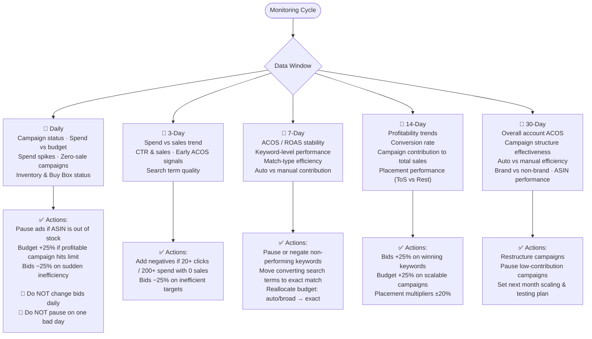

# Date-Wise Monitoring Rules – Decision Flow

```mermaid
flowchart TD
    Start([Monitoring Cycle]) --> Window{Data Window}

    Window --> D1["📅 Daily\nCampaign status · Spend vs budget\nSpend spikes · Zero-sale campaigns\nInventory & Buy Box status"]
    Window --> D3["📅 3-Day\nSpend vs sales trend\nCTR & sales · Early ACOS signals\nSearch term quality"]
    Window --> D7["📅 7-Day\nACOS / ROAS stability\nKeyword-level performance\nMatch-type efficiency\nAuto vs manual contribution"]
    Window --> D14["📅 14-Day\nProfitability trends\nConversion rate\nCampaign contribution to total sales\nPlacement performance (ToS vs Rest)"]
    Window --> D30["📅 30-Day\nOverall account ACOS\nCampaign structure effectiveness\nAuto vs manual efficiency\nBrand vs non-brand · ASIN performance"]

    D1 --> A1["✅ Actions:\nPause ads if ASIN is out of stock\nBudget +25% if profitable campaign hits limit\nBids −25% on sudden inefficiency\n\n🚫 Do NOT change bids daily\n🚫 Do NOT pause on one bad day"]
    D3 --> A3["✅ Actions:\nAdd negatives if 20+ clicks / 200+ spend with 0 sales\nBids −25% on inefficient targets"]
    D7 --> A7["✅ Actions:\nPause or negate non-performing keywords\nMove converting search terms to exact match\nReallocate budget: auto/broad → exact"]
    D14 --> A14["✅ Actions:\nBids +25% on winning keywords\nBudget +25% on scalable campaigns\nPlacement multipliers ±20%"]
    D30 --> A30["✅ Actions:\nRestructure campaigns\nPause low-contribution campaigns\nSet next month scaling & testing plan"]
```
